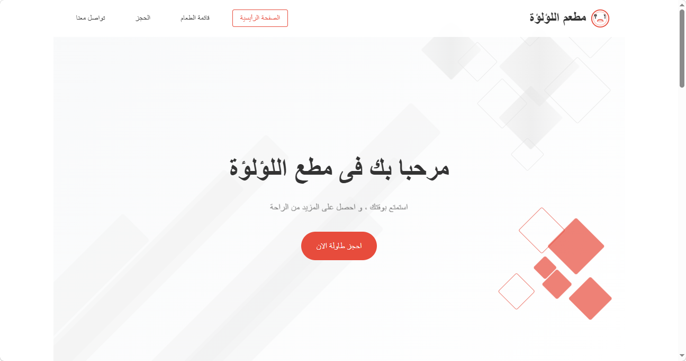
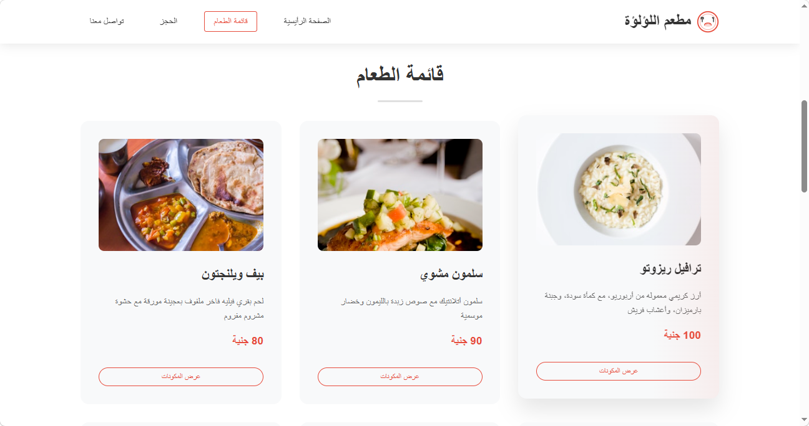
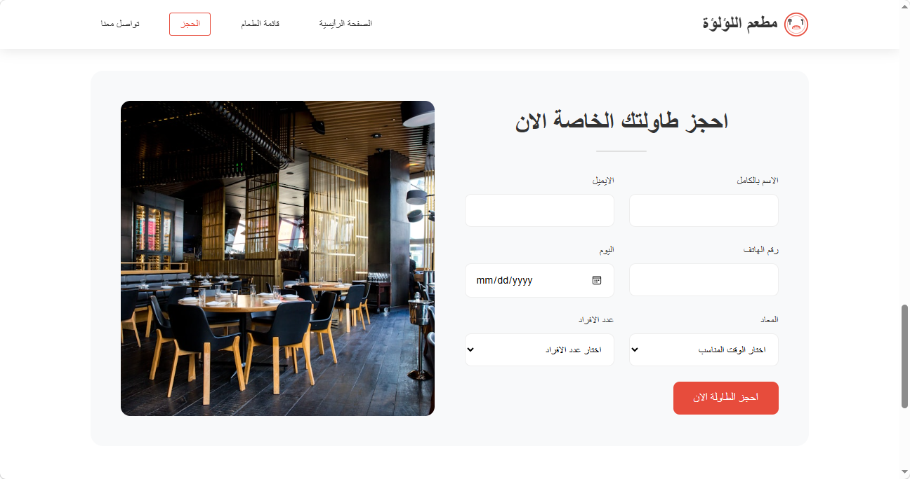
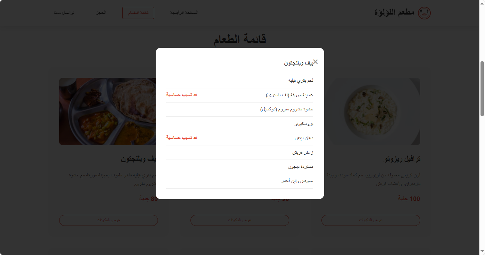

# Al-Loloa Restaurant
A simple responsive restaurant website built using **HTML**, **CSS**, and **JavaScript**.

## Preview

<table>
<tr>
<td></td>
<td></td>
</tr>

<tr>
<td></td>
<td></td>
</tr>
</table>

## Features

- Responsive design
- Interactive navigation menu
- Food menu section
- Reservation form
- Ingredients popup modal
- Smooth scrolling
- Mobile-friendly layout

## Technologies Used

- HTML5
- CSS3
- JavaScript (Vanilla JS)

## Project Information

This project was developed by **Nada Al-Eaqrab** as a training project for the student **Kholoud Ibrahim**.

## Author

**Nada Al-Eaqrab**

## License

This project is for educational purposes only.
